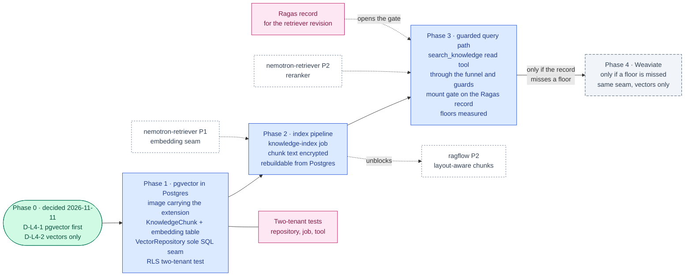

inflect · ai architecture · vector store · roadmap v2 · 2026-11-11

# The vector store: pgvector in Postgres first, Weaviate only on a measured floor, Layer 4

> **Status: living design** — the integration roadmap for Layer 4's "vector DB &
> multi-tenant isolation" box, which the target architecture fills with
> Weaviate. The owner decided on 2026-11-11 (D-L4-1) to deliver it first with
> the **pgvector** extension inside the existing Postgres, under the RLS that
> already protects every tenant row, and to bring Weaviate in only if a
> measured recall or latency floor is not met. The owner also adopted the
> **vectors-only rule** the same day (D-L4-2): no chunk text outside Postgres.
> The **Current state** section is true today (main 3.365.0, `8733323f5`). The
> **Roadmap** section is the plan. This is a child of
> [`docs/ai-architecture-roadmap.md`](../ai-architecture-roadmap.md): read that
> first for the target map, the global rules **G1–G13** every phase here
> inherits, and the sequencing. The filename keeps the box's name so links into
> it stay stable (the [`langflow.md`](./langflow.md) precedent). If the code
> contradicts a fact here, the code wins and the pull request that finds it
> corrects this document.

## Where it sits in the master roadmap

| | |
| --- | --- |
| Layer · box | 4 — Knowledge & deep RAG · "Weaviate (vector DB & multi-tenant isolation)" |
| Wave | 1 (the first Layer 4 wave, zero-GPU) — see master § Sequencing. Phase 4 (Weaviate) is conditional and has no wave until a floor is missed |
| Depends on | a Postgres image that carries the pgvector extension (Phase 1.1 — the image on the VM today does not); **an embedding provider to be useful** → [`nemotron-retriever.md`](./nemotron-retriever.md) |
| Unblocks | [`ragflow.md`](./ragflow.md) (somewhere for parsed chunks to go), [`ragas.md`](./ragas.md) / [`ares.md`](./ares.md) (something to evaluate), the assistant's `search_knowledge` tool |
| Owner decisions | **D-L4-1** decided 2026-11-11 (owner): pgvector first, in the existing Postgres under RLS; Weaviate only later, if a measured recall/latency floor is not met. **D-L4-2** decided 2026-11-11 (owner): vectors-only — no chunk text outside Postgres. Open, raised here: the floor values (Phase 3.6), the lexical arm (§ Fit), and the patch cadence of the self-built Postgres image (Phase 1.1): proposed default, keep the 2026-10-10 tag rule with a scheduled rebuild; the alternative, digest pins with a scheduled bump pull request, reverses that decision and is the owner's to take |
| Complete at | Phase 3. Phase 4 runs only if Phase 3's record misses a floor; until then it is not part of completion |

## At a glance

Green: decided, or on `main`. Blue: a phase not yet on `main`; it turns green (`done`) in the pull request that meets its "done when". Slate dashed: a conditional phase that starts only on a measured trigger. Dashed white: another roadmap this one waits on or unblocks. Pink: an evaluation record or a behavioural test.


```mermaid
flowchart LR
  P0(["Phase 0 · decided 2026-11-11<br/>D-L4-1 pgvector first<br/>D-L4-2 vectors only"]):::done
  P1["Phase 1 · pgvector in Postgres<br/>image carrying the extension<br/>KnowledgeChunk + embedding table<br/>VectorRepository sole SQL seam<br/>RLS two-tenant test"]:::todo
  P2["Phase 2 · index pipeline<br/>knowledge-index job<br/>chunk text encrypted<br/>rebuildable from Postgres"]:::todo
  P3["Phase 3 · guarded query path<br/>search_knowledge read tool<br/>through the funnel and guards<br/>mount gate on the Ragas record<br/>floors measured"]:::todo
  P4["Phase 4 · Weaviate<br/>only if a floor is missed<br/>same seam, vectors only"]:::optional
  EMB["nemotron-retriever P1<br/>embedding seam"]:::ext
  RER["nemotron-retriever P2<br/>reranker"]:::ext
  REC["Ragas record<br/>for the retriever revision"]:::eval
  RF["ragflow P2<br/>layout-aware chunks"]:::ext
  ISO["Two-tenant tests<br/>repository, job, tool"]:::eval
  P0 --> P1 --> P2 --> P3
  P3 -->|only if the record<br/>misses a floor| P4
  EMB -.-> P2
  RER -.-> P3
  REC -.->|opens the gate| P3
  P2 -.->|unblocks| RF
  P1 --- ISO

  classDef done fill:#d1fae5,stroke:#047857,color:#064e3b
  classDef todo fill:#dbeafe,stroke:#1d4ed8,color:#1e3a8a
  classDef gate fill:#ede9fe,stroke:#6d28d9,color:#3b0764
  classDef ext fill:#ffffff,stroke:#64748b,color:#334155,stroke-dasharray:3 3
  classDef eval fill:#fce7f3,stroke:#be185d,color:#831843
  classDef declined fill:#f3f4f6,stroke:#6b7280,color:#374151,stroke-dasharray:4 3
  classDef optional fill:#f1f5f9,stroke:#475569,color:#334155,stroke-dasharray:6 3
```

## Current state (true today)

- **There is a vector store SEAM and no vector store.**
  `src/app-layer/repositories/VectorRepository.ts` (2026-11-11, pgvector first)
  is the only way in, held by ESLint `local/vector-store-single-seam`; it is off
  unless `VECTOR_STORE_BACKEND=pgvector`, and no Postgres this repository runs
  carries the `vector` extension, so no table exists
  ([implementation note](../implementation-notes/2026-11-11-vector-store-seam.md)).
  `weaviate` returns nothing under `src/`; the 18 files matching `embedding`
  use the word in its prompt/UI sense (`risk-assessment/prompt-builder.ts`,
  `EvidenceGallery.tsx`). The database is PostgreSQL 16 behind PgBouncer, and
  the production stack (`deploy/docker-compose.prod.yml`, repo-canonical since
  #2849) runs `postgres`, `pgbouncer`, `redis`, `clamav`, `app`, `worker`,
  `watchtower`, `caddy` — nothing else.
- **The Postgres image cannot load pgvector.** Every Postgres in the
  repository is `postgres:16-alpine`: `deploy/docker-compose.prod.yml`, the
  four root Compose files (`docker-compose.yml`, `.test`, `.staging`, `.prod`)
  and the service containers of five workflows (`ci.yml` three times,
  `dast.yml`, `dast-full.yml`, `integration-stress.yml`, `load-test.yml`). The
  official image's `16/alpine3.23` Dockerfile compiles the core server and
  `contrib` and nothing else; pgvector is not in it. So `CREATE EXTENSION
  vector` fails on the production database, in every CI job, and in local
  development today.
- **The one extension a migration creates is `pg_trgm`**
  (`20260806150000_control_index_fit`), a contrib extension marked trusted,
  which a database owner may create without superuser. pgvector's
  `vector.control` (0.8.7, the current release) does not declare itself
  trusted, so `CREATE EXTENSION vector` needs a superuser.
- **The images that do carry pgvector are Debian.** `pgvector/pgvector`
  publishes `0.8.7-pg16`, `-bookworm` and `-trixie` tags, all built `FROM
  postgres:<major>-<debian>`. Moving the existing data volume from the
  Alpine (musl) image to a Debian (glibc) one changes the C library that
  orders text, so every index on a text column built under the old collation
  is suspect until it is rebuilt. Docker Hub lists `pgvector/pgvector:0.8.7-pg16-bookworm`
  at about 156 MB compressed against about 116 MB for `postgres:16-alpine`
  (read 2026-11-11).
- **Retrieval today is tool-shaped, not vector-shaped.** The assistant
  (`src/app-layer/ai/assistant/`) runs a tool loop over the product's own data
  through `runGuardedTool`; the questionnaire feature grounds answers from the
  answer library and ships evidence *titles* only. Agents read through the
  audited MCP read tools (`src/lib/mcp/tools/`). None of this needs a vector.
- **Two isolation layers protect every tenant row, and both are in Postgres.**
  RLS with `FORCE ROW LEVEL SECURITY` on every tenant table plus the
  application-layer `tenantId` filter in every repository
  (`tests/guardrails/rls-coverage.test.ts`,
  `tests/unit/tenant-isolation-structural.test.ts`). A table added in Postgres
  inherits both and the coverage guardrail fails CI until it has its
  policies; a store outside Postgres has neither.
- **Business content is encrypted at rest by a manifest.** `Finding.description`,
  `Risk.treatmentNotes`, `PolicyVersion.contentText`, `TaskComment.body` and the
  rest of `src/lib/security/encrypted-fields.ts` are ciphertext in the database
  and decrypted on read. Postgres cannot search ciphertext, lexically or
  otherwise.
- **Tenant data leaves with the tenant through one purge.** The tenant purge
  (`usecases/tenant-purge.ts`, the last step of `data-lifecycle`) deletes every
  tenant-scoped table except `TENANT_PURGE_RETAINED`, and soft-deletes are
  purged after 90 days (`docs/data-retention.md`). A tenant-scoped Postgres
  table is covered by that purge as soon as it exists; a second store is not.

## Fit, and what is deliberately not adopted

**Adopted (D-L4-1, 2026-11-11).** pgvector as the vector store, inside the
existing Postgres: the vectors sit in a tenant-scoped table under RLS and the
repository's `tenantId` filter, in the same backups, purged by the same tenant
purge, with no new service to deploy, secure or watch. Similarity is cosine
over an HNSW index, one partial expression index per embedding model, so two
models can be indexed side by side while D-L4-3 benchmarks them.

**Adopted (D-L4-2, 2026-11-11): the vectors-only rule.** Chunk text lives in
exactly one place: `KnowledgeChunk.text`, a Postgres column in the encryption
manifest. The embedding row carries `tenantId`, the chunk reference, the
embedding model id, the dimension count, a `contentHash` and the vector —
never the text. No other store, cache, log or service holds chunk text past
the job that produced it: not Weaviate if Phase 4 ever runs, not the parsing
service ([`ragflow.md`](./ragflow.md)), not a trace exporter.

**What the rule costs, said plainly.**

- *The vector itself is not encrypted.* An approximate-nearest-neighbour index
  needs plaintext floats, so the embedding column is a plaintext derivative of
  encrypted text, and embedding inversion is a real attack. It is classified
  as business content, it never leaves Postgres, and a database backup now
  carries it. Phase 2 records this in `docs/encryption-data-protection.md`
  rather than leaving it to be discovered.
- *There is no lexical arm.* Full-text search (BM25 in Weaviate, `tsvector` in
  Postgres) needs readable text or a plaintext token index next to the
  ciphertext. The earlier plan promised "hybrid BM25 + vector" in Weaviate
  while also keeping text out of Weaviate; those two cannot both hold, because
  Weaviate's BM25 indexes text properties. So Phase 3 is dense-only and its
  revision key carries no `alpha`. A lexical arm is an open question for the
  owner: none (rely on the reranker), a keyed blind-token index (an HMAC of
  each normalised token under a per-tenant key, matching exact terms without
  storing them), or a plaintext `tsvector` (which this document recommends
  against: it is the text, tokenised).

**Not adopted, with the reason.**

- *Weaviate now.* A second store whose isolation is a property of application
  code alone, a second backup and restore story, a second purge hook, and a
  1.5 GB line on a VM whose capacity budget already does not close (master §
  Capacity). It stays the measured alternative: Phase 4, triggered only by a
  missed floor.
- *An embedding computed inside the database* (any extension or module that
  calls a model from Postgres or Weaviate). The embedding comes from the
  retriever seam ([`nemotron-retriever.md`](./nemotron-retriever.md)) and
  nowhere else, so residency is decided once (G1).
- *Swapping the production image for `pgvector/pgvector` as the default path.*
  It changes the C library under an existing data directory (see Current
  state). Phase 1.1 builds pgvector onto the same Alpine base instead, and
  keeps the Debian image as the fallback that needs a reindex window.
- *A vector column on the source models.* Each source keeps its own table
  untouched; chunks and embeddings are their own models, so a re-chunk or a
  model change never rewrites a policy or a finding.

## Roadmap (future direction)

### Phase 0 — Decide the store and the rule (decided)

**Sub-phases.**
- [x] 0.1 D-L4-1 decided by the owner on 2026-11-11: pgvector first, in the
      existing Postgres under RLS; Weaviate only later, if a measured recall
      or latency floor is not met.
- [x] 0.2 D-L4-2 decided by the owner on 2026-11-11: vectors-only, no chunk
      text outside Postgres.
- [x] 0.3 The decision, the image fact-check and the lexical-arm finding are
      recorded in
      `docs/implementation-notes/2026-11-11-knowledge-stack-replan.md`.

**Done when.** The note is on `main` and the owner's initials and date are in
the master roadmap's decision table for D-L4-1 and D-L4-2.

### Phase 1 — pgvector in Postgres, and the single seam

**Goal.** Every Postgres the product runs against can load pgvector; the
knowledge tables exist under RLS; exactly one module issues SQL against a
vector column.

**Sub-phases.**
- [ ] 1.1 **The image.** `deploy/postgres/Dockerfile`: `FROM
      postgres:16-alpine`, compiling pgvector at a pinned tag (`v0.8.7`
      today) against the image's own server headers, the build toolchain
      removed in the same layer. Same base, same musl, same collation, so the
      existing `pgdata` volume mounts unchanged. **The base stays on the tag,
      not a digest, on purpose:** the owner decided on 2026-10-10 that the
      production database is baselined by tag because "a digest pin would
      freeze security patches that the alpine tag delivers"
      (`tests/guardrails/runtime-image-pinning.test.ts`, the `postgres`
      entry). A self-built image would freeze them anyway unless it is
      rebuilt, so the workflow that publishes it to GHCR runs **on a
      schedule** (weekly) and whenever the upstream `16-alpine` digest
      changes, republishing a moving line tag (`…/postgres-pgvector:16-alpine`)
      plus an immutable per-build tag for rollback. Compose and CI reference
      the line tag, never `latest`, and the new repository gets its own
      `BASELINE` entry in that guard with the same reason as `postgres`. A
      patch then reaches the VM the way it does today, on a pull and
      `deploy/apply.sh` (Watchtower does not manage `postgres`). Pinning the
      base and the references by digest instead, with a bump pull request on
      the same cadence, would reverse the 2026-10-10 decision, so it is raised
      for the owner (§ Owner decisions) rather than taken here. The fallback,
      `pgvector/pgvector:0.8.7-pg16-bookworm`, is taken only with a planned
      `REINDEX DATABASE` (or dump and restore) window, written into the pull
      request's rollback plan.
- [ ] 1.2 **Every Postgres moves together.** The production Compose file, the
      four root Compose files and the five workflows' service containers all
      reference the same image and line tag, or the fresh-DB migration gate
      fails in CI the day the first `CREATE EXTENSION vector` lands. A guard
      pins that every Postgres image reference in the repository is that one
      image.
- [ ] 1.3 **The extension.** A migration runs `CREATE EXTENSION IF NOT EXISTS
      vector`. Because the extension is not trusted, the role that runs
      `prisma migrate deploy` must be a superuser, or the operator creates the
      extension once as `postgres` before the migration (which is then a
      no-op). The pull request states which role the production
      `DIRECT_DATABASE_URL` uses, read off the VM, not assumed.
- [ ] 1.4 **The models**, in a new `prisma/schema/knowledge.prisma`:
      `KnowledgeChunk` (tenantId, sourceModel, sourceId, chunkIndex, `text` in
      the encryption manifest, contentHash, `chunkerRevision`) and
      `KnowledgeChunkEmbedding` (tenantId, chunkId with `ON DELETE CASCADE`,
      embeddingModel, dimensions, contentHash, `embedding
      Unsupported("vector")`). RLS policies and `FORCE ROW LEVEL SECURITY` in
      the migration; `tenantId`-leading indexes; both classified in
      `docs/data-retention.md` as business records purged with their source
      and with the tenant, before the migration lands
      (`retention-policy-coverage.test.ts`).
- [ ] 1.5 **The seam.** `src/app-layer/repositories/VectorRepository.ts` is the
      only module that reads or writes `KnowledgeChunkEmbedding.embedding`:
      Prisma cannot read an `Unsupported` column, so every access is
      parameterised `$queryRaw` (never `$queryRawUnsafe`) inside
      `runInTenantContext`, and every method takes `ctx: RequestContext` and
      also filters on `ctx.tenantId`. No method takes a tenant id as a plain
      argument. A rule refuses SQL naming the embedding table anywhere else
      (G10: a structural rule is an ESLint rule where the shape allows it).
- [ ] 1.6 **The index.** One HNSW expression index per embedding model, partial
      on that model: `USING hnsw ((embedding::vector(<dims>))
      vector_cosine_ops) WHERE "embeddingModel" = '<id>'`. The `vector` type
      indexes at most 2,000 dimensions (`halfvec` at most 4,000), so a model
      emitting 2,048 (Nemotron embed's default) is either truncated to a
      supported Matryoshka size or stored as `halfvec`; the D-L4-3 benchmark
      names which. `CREATE INDEX` runs in the migration's transaction, so not
      `CONCURRENTLY` (the `pg_trgm` migration's note says why). **The CI
      fresh-DB schema-drift gate sees each of these indexes.** Prisma cannot
      declare a partial expression index with an operator class, so
      `prisma migrate diff` proposes `DROP INDEX "<name>";` for every one, and
      "Gate: fresh-DB schema drift" fails on any statement not in
      `prisma/fresh-db-schema-drift.expected.sql`. The same pull request adds
      each statement there, verbatim, and signs it off in `SIGNED_OFF` in
      `tests/guardrails/schema-drift-gate-runs-in-ci.test.ts`, which holds the
      file to set equality. The `pg_trgm` indexes are the precedent (group 2,
      PERMANENT): the new members join that group, renamed to cover indexes
      Prisma cannot declare, because the header-count check counts every
      `DROP INDEX` statement as group 2; the header's group-2 count and the
      CURRENT STATE row move in the same commit. Each further embedding model
      that gets an index adds a member, so the D-L4-3 benchmark's candidates
      are measured against exact search without an index, and only the
      adopted model's index lands in a migration. Any other residue the new
      tables produce (the `Unsupported("vector")` column, the extension) is
      measured with `npm run db:check-schema-drift` and reconciled or signed
      off the same way, never pasted in unsigned.
- [ ] 1.7 **The two-tenant behavioural test** (G7, checklist §2), in the
      integration project as `app_user` with RLS live: A inserts chunks and
      embeddings; a nearest-neighbour query under B returns nothing; B asking
      for A's chunk id returns nothing; purging tenant A leaves no row of
      either table.
- [ ] 1.8 **Signals.** `/api/readyz` does not gate on the index; an outcome
      metric `vector_index.requests` with an `outcome` label and a latency
      histogram (checklist §4) carry the alerting.

**Prompt.**
```text
Context (main 3.365.0): decisions D-L4-1 (pgvector first, in the existing Postgres under
RLS) and D-L4-2 (vectors-only: chunk text only in Postgres, encrypted) are taken. Every
Postgres in the repo is postgres:16-alpine, whose official build carries no pgvector; the
production Compose file is repo-canonical (deploy/docker-compose.prod.yml, applied by
deploy/apply.sh); runtime images are pinned by digest EXCEPT the Docker Official Images in
tests/guardrails/runtime-image-pinning.test.ts's BASELINE, where postgres is baselined by tag
by owner decision (2026-10-10) so the alpine tag keeps delivering security patches. pgvector's vector.control is not
trusted, so CREATE EXTENSION vector needs a superuser. Repositories take RequestContext and
filter by tenantId; tenant tables carry RLS (tests/guardrails/rls-coverage.test.ts).

Task: (1) deploy/postgres/Dockerfile FROM postgres:16-alpine (by tag, keeping the
2026-10-10 decision) building pgvector at a pinned tag, toolchain removed in the same layer; a
workflow publishing it to GHCR weekly and whenever the upstream 16-alpine digest changes, as a
moving line tag plus an immutable per-build tag; a BASELINE entry for the new repository in
runtime-image-pinning.test.ts; every Postgres reference (prod Compose, root Compose files,
workflow service containers) moved to that line tag, with a guard pinning it. Do NOT pin the
base or the references by digest unless the owner has decided to (weaviate.md § Owner
decisions). (2) A migration creating the extension, and the note
on which role runs migrations in production. (3) prisma/schema/knowledge.prisma with
KnowledgeChunk (text in the encryption manifest) and KnowledgeChunkEmbedding (embedding
Unsupported("vector"), cascade from the chunk), RLS policies, tenantId-leading indexes,
data-retention rows. (4) VectorRepository.ts as the only module touching the embedding
column: parameterised $queryRaw inside runInTenantContext, ctx-first methods, plus a lint
rule refusing SQL on that table elsewhere. (5) One partial HNSW index per embedding model,
and for each the DROP INDEX statement prisma migrate diff will propose added verbatim to
prisma/fresh-db-schema-drift.expected.sql and signed off in SIGNED_OFF in
tests/guardrails/schema-drift-gate-runs-in-ci.test.ts (join group 2, the pg_trgm precedent,
and update the header counts); run npm run db:check-schema-drift to see the residue rather
than guessing it.

Constraints: no text column on the embedding table; no $queryRawUnsafe; readyz does not gate
on the index. Integration test (tests/integration/vector-tenant-isolation.test.ts): A
inserts, B's nearest-neighbour query returns nothing, A's chunk id under B returns nothing,
purging tenant A leaves no rows. Name tests for the invariant. Write an implementation note,
with the rollback plan and risk assessment a SIGNIFICANT change carries (schema migration,
image change).

Done when: typecheck, lint, the new integration test and the existing ratchets (rls-coverage,
schema-index-coverage, retention-policy-coverage, docs-accuracy, schema-drift-gate-runs-in-ci)
are green; CI's fresh-DB migration gate and its schema-drift gate pass on the new image; deploy/check-drift.sh reports no drift after apply.
```

**Hardening.** G5 (an image the repository builds, on a patch-delivering
rebuild schedule rather than a frozen digest, by the 2026-10-10 decision), G7 (RLS
inherited, the two-tenant test at the repository layer, no plain-tenant-id
method), G9 (no embedding provider configured = nothing indexed, nothing
offered), checklist §4 (outcome metric). The lint rule is the structural guard
and the integration test the conduct guard — both, per the checklist's "shape
and conduct". The image move is a SIGNIFICANT change under
`docs/change-management-policy.md`: a rollback plan (the previous per-build tag, and
for the Debian fallback the reindex) and a risk assessment go in the pull
request.

**Done when.** The new image runs on the VM with the extension created, the
two-tenant test is green in the integration shards, and `VectorRepository.ts`
is the only module the lint rule admits.

### Phase 2 — The index pipeline (write side)

**Goal.** Chunks and their embeddings are written by the worker only, and the
whole index can be rebuilt from `KnowledgeChunk` rows.

**Sub-phases.**
- [ ] 2.1 A BullMQ job `knowledge-index` (G8) that takes `(tenantId, sourceModel,
      sourceId)`, reads the source row under `runInTenantContext`, chunks it
      (a plain paragraph chunker now; the parsing service later), embeds
      through the retriever seam, and upserts `KnowledgeChunk` and
      `KnowledgeChunkEmbedding` rows keyed by `contentHash`, so a re-run is a
      no-op.
- [ ] 2.2 Triggers: the audit emitters for the source models enqueue the job
      after create and update; the `data-lifecycle` purge deletes a source's
      chunks when it hard-deletes the source (the reference is polymorphic, so
      no foreign key does it); the tenant purge removes both tables with
      everything else tenant-scoped.
- [ ] 2.3 `scripts/knowledge-reindex.ts`: re-embed a tenant's chunks from
      `KnowledgeChunk` text and rebuild its embedding rows. A test proves the
      rebuild reproduces the same `contentHash` set and, under the same model
      revision, vectors within a stated cosine tolerance. That test is what
      "rebuildable from Postgres" means, and it is also the migration path to
      a new embedding model.
- [ ] 2.4 `docs/encryption-data-protection.md` gains the embedding column: a
      plaintext derivative of encrypted text, classified business content,
      held only in Postgres and its backups.
- [ ] 2.5 First sources, in this order: `PolicyVersion.contentText` (approved
      versions only), evidence file text (post-ClamAV, via the parser seam),
      control descriptions, the questionnaire answer library.

**Prompt.**
```text
Context (main 3.365.0 + Phase 1): KnowledgeChunk (text encrypted) and KnowledgeChunkEmbedding
(pgvector, RLS) exist; VectorRepository.ts is the only seam to the embedding column. Background
jobs live in src/app-layer/jobs/ and wrap in runJob(); the executor registry is
executor-registry.ts. Soft-deletes and hard-deleted sources are purged by data-lifecycle; the
tenant purge removes tenant-scoped tables.

Task: (1) Job `knowledge-index` keyed (tenantId, sourceModel, sourceId): read under
runInTenantContext, chunk, embed via the EmbeddingProvider seam (nemotron-retriever Phase 1;
use its stub if it has not landed), upsert chunks and embeddings by contentHash. (2) Enqueue
from the audit emitters of PolicyVersion (approved only) and evidence file text; delete a
source's chunks in the data-lifecycle purge. (3) scripts/knowledge-reindex.ts rebuilding a
tenant's embeddings from KnowledgeChunk, exercised by a test. (4) The embedding column's row
in docs/encryption-data-protection.md.

Constraints: the job never runs on the web tier; a chunk of an encrypted source is itself an
encrypted column; every findMany bounded (take:) or carrying the guardrail-allow comment.
Two-tenant test for the job: indexing A's policy creates nothing B can query.

Done when: the reindex test proves rebuild, the index-coverage, query-shape and
sanitize-rich-text-coverage ratchets are green, and a policy approved in a seeded tenant is
chunked and embedded within one job run.
```

**Hardening.** G7 (RLS on both tables), G8 (worker only, `runJob`, resumable).
G4 is not yet in play: nothing reads from the index into a model in this phase,
by design. The encryption-manifest entry for `KnowledgeChunk.text` is the most
important line in the diff, and the data-protection row for the embedding is
the most important sentence: one is the protection, the other is the honest
account of what it does not cover.

**Done when.** A policy approved in a tenant appears as chunks and embeddings
within one job run; purging the tenant leaves no row; the reindex test is
green.

### Phase 3 — The query path (read side), guarded, and the floors measured

**Goal.** Nearest-neighbour search is a read tool like any other: offered
through the allowlist and ceiling, executed through the funnel, its results
scanned on the way into model context, and evaluated before it is offered at
all. The same record measures the floors that decide whether Phase 4 ever runs.

**Sub-phases.**
- [ ] 3.1 `VectorRepository.search(ctx, query, { k })` — cosine over the
      current model's partial index, tenant rows only, returns chunk
      references and scores; text is hydrated through the normal repositories
      under RLS (decrypting via the manifest).
- [ ] 3.2 **Filtered search must not lose recall.** HNSW returns its
      `ef_search` nearest candidates across the whole table and RLS then
      removes other tenants' rows, so a small tenant in a large table can get
      fewer than `k` results or none. The search sets `hnsw.iterative_scan =
      relaxed_order` (pgvector 0.8) with a bounded `hnsw.max_scan_tuples`, and
      below a per-tenant row count it takes an exact scan instead of the
      index. The recall measurement in 3.6 is what proves this works.
- [ ] 3.3 An MCP read tool `search_knowledge` in `src/lib/mcp/tools/`, so Flue,
      the Tool Runner and external MCP clients all reach it through
      `runGuardedTool → runReadTool` (G3), subject to the agent's allowlist and
      ceiling, with `resourceScope` set and `k` bounded (at most 20).
- [ ] 3.4 The assistant offers the same tool from `assistant/tools.ts`; result
      text passes `guardUntrustedInput` before entering context and
      `guardEgress` before leaving to an external provider (G4) — the existing
      three-slice sandwich in `tools-adapter.ts` applies unchanged because the
      tool is a read tool.
- [ ] 3.5 The mount gate: `search_knowledge` is offered only when a RAG
      evaluation record ([`ragas.md`](./ragas.md), G11) exists for the current
      retriever revision `{embeddingModel, dimensions, rerankModel, chunker, k,
      indexParams}` and passes its floors — the same shape as the skills mount
      gate in `flue/skills/mount-gate.ts`. Reranking
      ([`nemotron-retriever.md`](./nemotron-retriever.md) Phase 2) changes the
      revision key and so forces a new record.
- [ ] 3.6 **The Weaviate trigger, measured.** The nightly record also carries
      two retrieval figures, computed by the harness on the seed corpus scaled
      to a stated multiple of the largest tenant's chunk count: recall@10 of the
      indexed, RLS-filtered query against an exact scan of the same tenant, and
      p95 latency of `search` at `k = 10`. Proposed floors, for the owner to
      confirm or change before they bind: recall@10 at least 0.95 of exact, p95
      at most 300 ms on the VM. A miss on two consecutive nightly records,
      after the tuning in 3.2, is the trigger for Phase 4; one miss is a
      tuning task.

**Prompt.**
```text
Context (main 3.365.0 + Phases 1–2): every engine's tool call goes through runGuardedTool →
runReadTool / runProposeTool (src/lib/agentic/engine-tools/); MCP read tools live in
src/lib/mcp/tools/ with name, description, inputSchema, resourceScope; the assistant's tools
are in src/app-layer/ai/assistant/tools.ts; tool results are scanned by guardUntrustedInput
and guardEgress in flue/tools-adapter.ts. Skills are mounted only with an evaluation record
(flue/skills/mount-gate.ts). KnowledgeChunk + KnowledgeChunkEmbedding (pgvector, RLS) exist.

Task: (1) VectorRepository.search(ctx, query, {k}) — cosine over the current model's partial
HNSW index with hnsw.iterative_scan = relaxed_order and a bounded max_scan_tuples, an exact
scan below a per-tenant row threshold, tenant rows only; returns {chunkId, sourceModel,
sourceId, chunkIndex, score}; text hydrated via the existing repositories under RLS. (2) A
read tool `search_knowledge` in src/lib/mcp/tools/ (resourceScope set, argsSchema validated,
k ≤ 20). (3) Offer it from the assistant's tool list. (4) A mount gate: offered only when a
RAG evaluation record for the current retriever revision exists and passes floors; without
one the tool is absent and the run message says so (see flue/empty-toolset-message.ts).
(5) The record carries recall@10 (indexed vs exact, under RLS) and p95 latency at k = 10.

Constraints: no permission check, usecase or Prisma call inside the tool module — the funnel
decides. Results are untrusted input. Tests: B's chunks never appear in A's results through
the tool; a small tenant beside a large one still gets k results; a flagged result halts the
step (reuse the review latch); the tool module imports nothing from repositories except
VectorRepository. Update docs/sub-processors.md's Anthropic/OpenRouter rows' "data shared" to
include retrieved chunk text when the tenant's residency is EXTERNAL.

Done when: the tool appears on /agents/[agentId] Tools tab for an agent granted it, the
two-tenant, small-tenant and halt tests are green, and the mount gate refuses with no record.
```

**Hardening.** G3 (funnel only), G4 (three slices, unchanged), G2 (the
sub-processor rows gain a data category: retrieved chunk text leaves to the
model vendor for EXTERNAL tenants), G11 (no record, no tool), G7 (the
two-tenant test at the tool layer, not only the repository layer). Bound `k`;
an unbounded retrieval is the N+1 of RAG. The small-tenant test is the one that
catches the filtered-search failure, which no two-tenant test of equal-sized
tenants can see.

**Done when.** A seeded tenant's agent, granted `search_knowledge`, answers a
posture question with cited chunks; the same question under a second tenant
cites none of them; the nightly Ragas job has produced the record the gate
consumed, with the two floor figures in it.

### Phase 4 — Weaviate, only if a floor is missed (conditional)

**Trigger.** Phase 3.6's floor missed on two consecutive nightly records after
tuning. Without the trigger this phase does not start, and the roadmap is
complete at Phase 3.

**Goal.** A second backend behind the same `VectorRepository` interface,
serving the queries pgvector could not, with Postgres still the system of
record and every rule above unchanged.

**Sub-phases.**
- [ ] 4.1 A measured memo (implementation note): the two missed records, the
      tuning tried, Weaviate's figures on the same harness, the capacity line
      and D-CAP-1's answer. The owner initials adoption in the master's
      decision table before any code lands.
- [ ] 4.2 A `weaviate` service, digest-pinned, no modules (`ENABLE_MODULES`
      empty, `vectorizer: none`), API-key auth, a named volume, no published
      port; `WEAVIATE_URL` / `WEAVIATE_API_KEY` optional in `src/env.ts`
      (absent = the pgvector backend serves). Native multi-tenancy, one shard
      per tenant, `autoTenantCreation: false`.
- [ ] 4.3 Vectors only, still: objects carry the chunk reference, the model id,
      the `contentHash` and the vector, no text property — so no BM25 there
      either. The shard is rebuilt from `KnowledgeChunkEmbedding` rows (no
      re-embedding), which keeps "losing Weaviate loses nothing" true by
      construction.
- [ ] 4.4 Tenant lifecycle: the shard is created on first index and deleted by
      the tenant purge, both idempotent and audited, because Weaviate is
      outside the purge's reach otherwise.
- [ ] 4.5 The two-tenant test again, at the shard: A inserts, B sees nothing,
      A's object id under B returns nothing, purging A removes the shard.
      Here isolation is application code alone, so this test carries the
      whole argument.

**Hardening.** G5, G6 (operator-set URL only; the client is the only socket),
G7 (the shard test), G9 (absent config = pgvector). The memo comes first
because adopting a second store is a decision, not a tuning step.

**Done when.** The memo is initialled, the shard two-tenant test is green, and
the mount gate's record for the Weaviate-backed revision meets the floor that
pgvector missed.

## Evals for this framework

| What | How | Record |
| --- | --- | --- |
| Isolation | two-tenant behavioural tests at repository, job and tool layers (Phases 1–3), plus the small-tenant recall test | CI integration and `test` shards |
| Retrieval quality | context precision / recall over the seed corpus — [`ragas.md`](./ragas.md); calibrated judges later — [`ares.md`](./ares.md) | evaluation record in the house shape (G11), consumed by the Phase 3 mount gate |
| The Weaviate trigger | recall@10 indexed vs exact under RLS, p95 latency at `k = 10` (Phase 3.6) | the same nightly record |
| Rebuildability | `knowledge-reindex` reproduces the embeddings (Phase 2.3) | CI |
| Operational | `vector_index.requests{outcome}` metric; latency histogram | alerts, not readyz |

## Updating the master

When a phase lands: flip this framework's row in the master
[Status board](../ai-architecture-roadmap.md#status-board), link the PR, and
move any fact that changed in **Current state** above into the present tense in
the same pull request. The row's name follows the decision: "Vector store
(pgvector; Weaviate conditional)". The capacity budget's "Vectors" line moves
inside `postgres` (no new container) until Phase 4 is triggered. A phase that
changes a decision (D-L4-1, D-L4-2) is recorded in the master's decision table
before the code merges.
